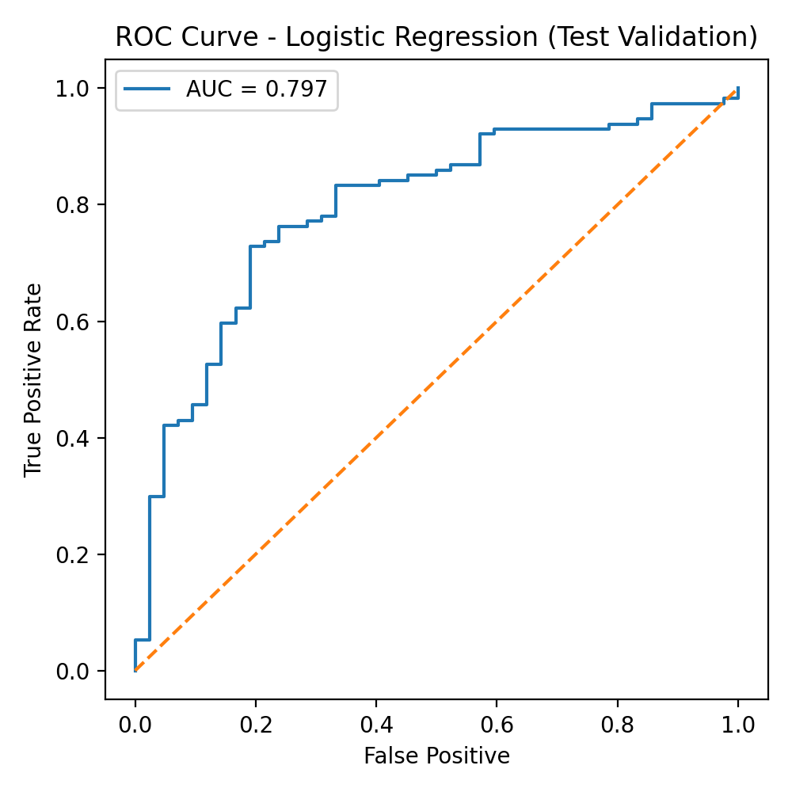
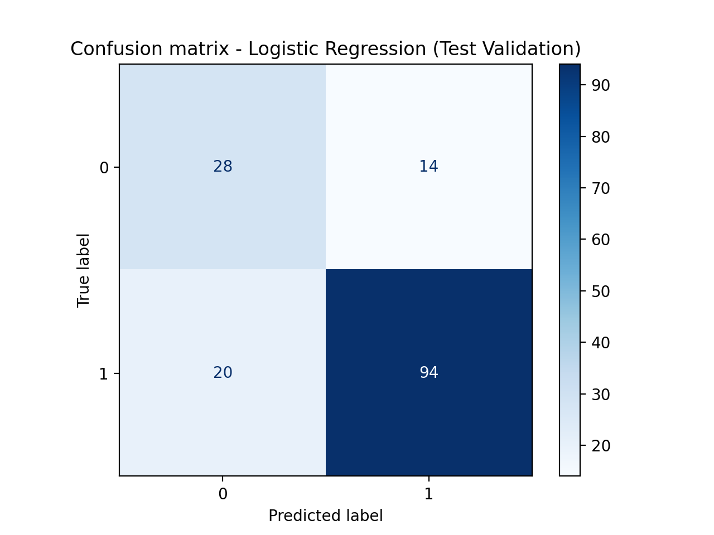
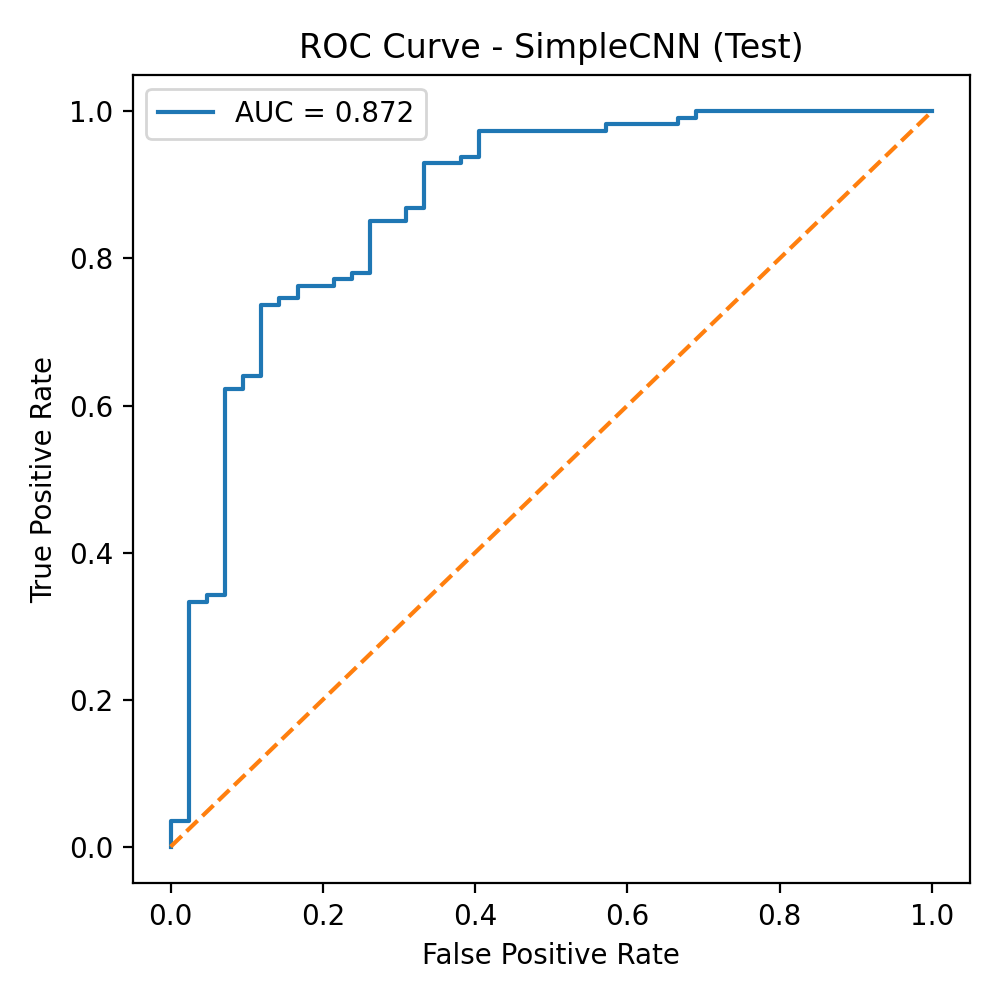
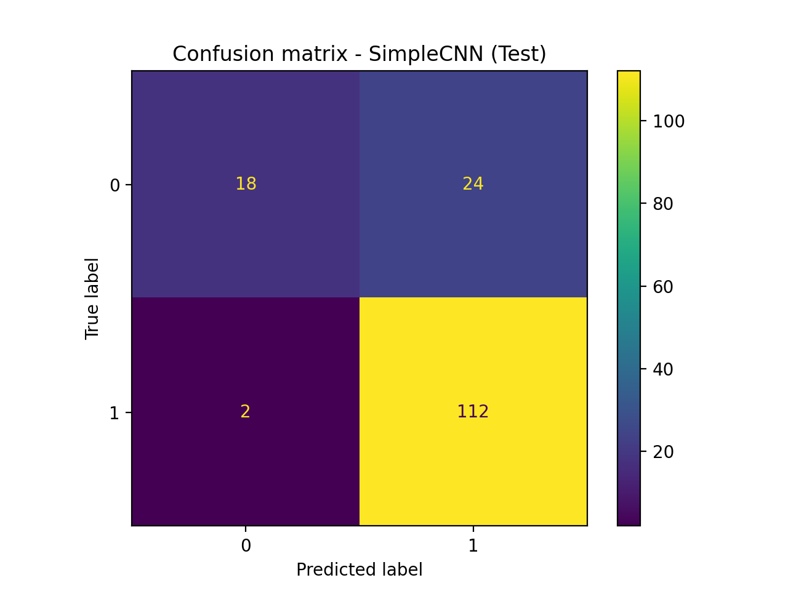

# Medical Imaging Classification & Dataset Analysis (MedMNIST)

## Overview
This project builds a reproducible Python pipeline to:
- load and explore a medical imaging dataset,
- report dataset distributions and basic statistics,
- train baseline classification models,
- evaluate performance using standard metrics and visualisations.

The focus is on data quality, reproducibility, and clear evaluation rather than model complexity.

## Dataset
This project uses **MedMNIST** (BreastMNIST), a lightweight biomedical image classification dataset.

### Data governance / ethics note
- The dataset used is publicly available and provided in a preprocessed benchmark format.
- No patient-identifiable data is used or stored in this repository.
- This repository does not include any raw dataset files.

## Project structure
- `notebooks/` — exploratory analysis, preprocessing, training, evaluation
- `src/` — reusable Python modules (preprocessing, models, evaluation)
- `results/` — exported plots and evaluation outputs
- `data/` — empty; see dataset section (no raw data committed)

## Setup
Create and activate a virtual environment, then install dependencies:

```bash
pip install -r requirements.txt, 
```
## Results

### Logistic Regression (Baseline)



### CNN Model

